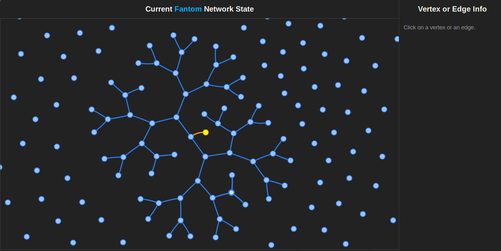
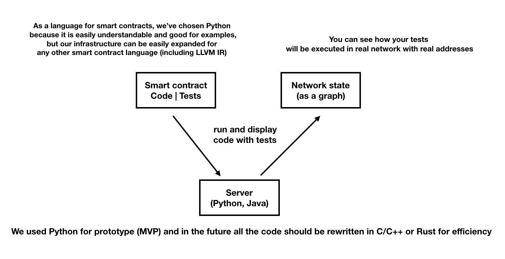
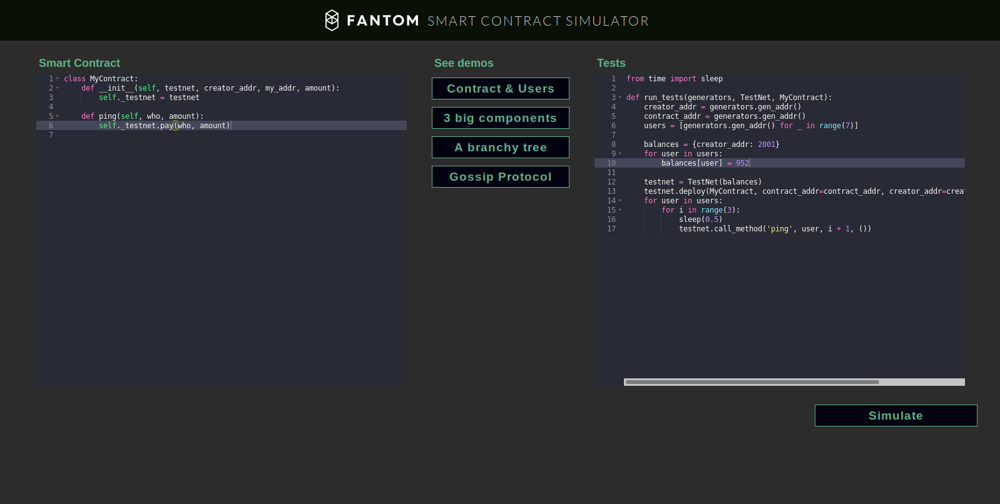
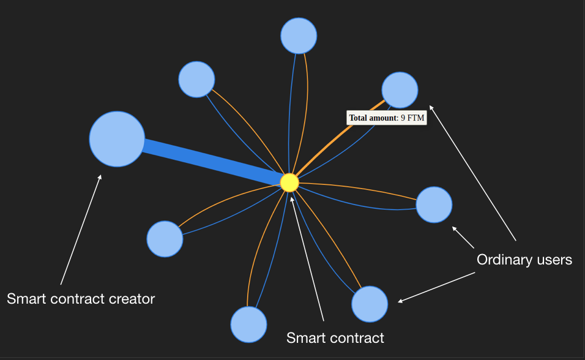

## Hello, this is my solution for the Crypto Bazar Serial Hackathon.
Task I have solved is from Fantom project: a simulator for smart contracts to show how a network will change after the deployment.

Let's see what I've done!

# Structure

<ol type="1" style="font-size: x-large;">
<li> [Premise](#premise)
<li> [Solution](#main-idea)
<ol type="a" style="font-size: large;">
  <li> [LIVE DEMO](https://www.youtube.com/watch?v=r4JFkFgU8p0&feature=youtu.be)
  <li> [Web-site](http://209.97.131.179:8096)
  <li> [Explanation](#explanation)
</ol>
<li> [Directory Structure](#directory-structure)
<li> [Installation](#installation)
<li> [Team](#team)
</ol>

## Premise
It's very important for developers to test their contracts beforehand, but logs and `stderr` don’t always give a comprehensive information about the program and its trustworthiness.

## Main Idea
So, the main idea of my solution is to show how smart contract changes the network in a very comfortable, user-friendly form.

It is important not only for developers, but also for users, because with my solution anyone will be able to check and ensure that everything works correctly and the system is safe.

This is what my solution looks like right now, and you can see the <a href="https://youtu.be/r4JFkFgU8p0">LIVE DEMO</a>:
.
You can also check it out on the web site; <a href="http://209.97.131.179:8096">http://209.97.131.179:8096</a>.

Below, you can find the explanation of every single part of the infrastructure.

# Explanation
My solution is a web site, which allows anyone to develop and test smart contracts for the Fantom network in real time, and see what is happening with your own eyes.


First of all, you need to write your own smart contract and some tests for it. You also can choose a standard one. After that, you can go on the web site and paste the contract code to the left part of the page, and tests to the right part.



Finally, you just need to click the "Simulate smart contract execution" button, and see the result! All the logs, errors and exceptions can be seen in the terminal below the code and the resultant network with real-time execution will be opened in the new tab.

A network is shown as a graph where vertices are addresses and edges are transactions.

Every smart contract is a special "yellow" vertex and all the vertices related to this smart contract have a special color.

Also, sizes of vertices are calculated with the following formula: R(vertex) = max(R_0, log(balanceOf(vertex))). Log function is needed for smoothness of a representation.



As you can see, widths of edges are different and depend on the amount of transactions. The formula is the following: Width(edge) = max(default_width, log(transaction_amount(edge))). In mathematical terms, this is a hyper edge and the whole system with smart contracts can be considered as a hyper graph.


All the edges and vertices are clickable and contain information about themselves. So, in the right part of the web site you can see the info, such as total balance for every vertex and list of latest transactions with amounts and links to the <a href="https://explorer.fantom.foundation">Fantom Explorer</a> for every edge.


# Directory structure

    /examples (default smart contract code and tests for it)

    /static (static html for the visualization web site)

    /web-runner (server and dynamic part of the visualization web site)

    /tests (automated tests)

    /demo{2,3,4}.py (demos for the web site: http://209.97.131.179:8096)

    /main.py (main backend for visualizations)

    /runner.py (for local test execution: `./runner.py examples/contract.py examples/test.py`)

    /generators.py and /testnet.py (library files for the backend)

    /gossip (Gossip protocol visualization)

# Installation
To install and test all the code locally, use this guide.
First of all, clone the source code:
```
git clone https://gitlab.com/doushiyou/dns.git
```
Then, you need to install the requirements:

```
sudo pip3 install -r requirements.txt
```

Run `./main.py` to start the server; it works on the 8080 port. Then go to http://localhost:8080 to see the demo.

* Run `./runner.py example/contract.py example/tests.py` to run the example contract.

* Run `./demo2.py`, `./demo3.py`, or `./demo4.py` to run the graph demos.

* Run `./tests/test1.sh` to run the automated test.

# Gossip protocol visualization
Install the requirements:

```
sudo pip3 install -r gossip/requirements.txt
```
Then, launch the server:
```
gossip/main.py
```
and direct your browser to http://localhost:8035/.


# Launching the site locally
```
docker build -t fantom-simulator .
docker run -p 80:8096 -p 8080:8080 -d fantom-simulator
```

# Team
<b>Igor Evdokimov</b>, <b>Zeeshan Yousaf</b> and others.


<i>Different smart contracts with their impacts on the network resultant</i>
