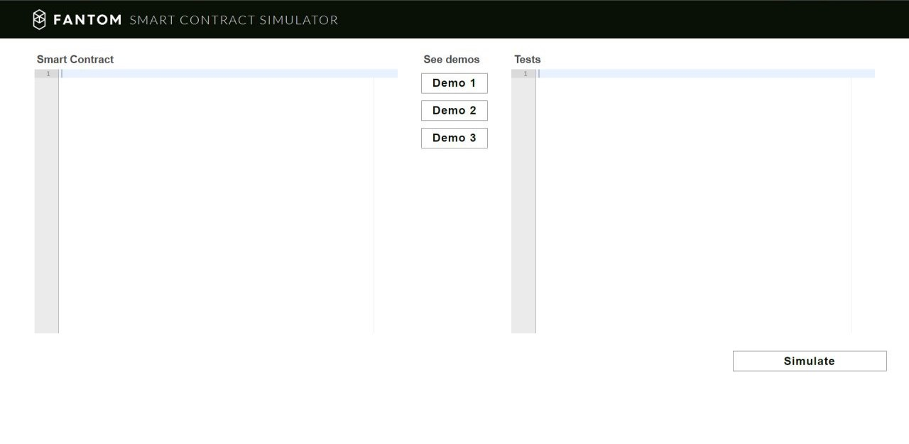

Hello, this is my solution for the Crypto Bazar Serial Hackathon.
Task I have solved is from Fantom project and I was asked to implement a simulator for smart contracts to show how a network will change after the deployment.

Let's see what I've done!

## Premise
For developers it is very important to test their contracts on the real data with some crash tests, but logs and `stderr` don't always give a comprehensive information about the programm and its trustworthy.

## Main Idea
So, main idea of my solution is to show how does smart-contract change the network in very comfortable, user-friendly form. 

It is important not only for developers, but also for users, because with my solution every single person will be able to check and ensure that everything works correcly and the system is safe.

That is how does my solution look like right now:

Below you can find an Explanation of every single part of this infrastructure.

# Explanation
My solution is a web-site, which allows develop and test smart-contracts for fantom network in realtime, and see what is happening with your own eyes.


First of all, you need to write your own smart contract and some tests for them. You also can choose some standarted one and use my standart tests. After that you can go on my web-site and past code in the left part of the page and tests in the right part.


Finally you need just click *Simulate smart contract execution* button, and see the result! All the logs, errors and exeptions can be seen in the terminal below the code and the resultant network with real-time execution will be opened in the new tab.

A network is shown as a graph where vertices are addresses and edges are transactions.

Every smart-contract is a special "Yellow" vertex and all the vertices related to this smart contract have a special color.
Also, sizes of vertices are calculated with formula: R(vertex) = max(R_0, log(balanceOf(vertex))).
(log function is needed for smoothness of a representation)


As you can see, widthes of edges are different and depends of transactions amount. Calculating formula is the following: Width(edge) = max(default_width, log(transaction_amount(edge))). In the mathematical terms, this is a hyper edge and all the system with smart contracts can be considered as a hyper graph.


All the edges and vertices are clicable and contain information about themselves. So, in the right part of the web site you can always see some info, such as total balance for every vertex and list of latest transactions with amounts and links to the <a href="https://explorer.fantom.foundation"> Fantom Explorer </a> for every edge.


# Installation
To install and test all the code locally, use this guide.
First of all, clone the source code:
```
git clone 
```
# ВСТАВИТЬ ССЫЛКУ
Then, you need to install the requirements:

```
sudo pip3 install -r requirements.txt
```

Run `./main.py` to start the server; it works on the 8080 port. Then go to http://localhost:8080 to see the demo.

* Run `./runner.py example/contract.py example/tests.py` to run the example contract.

* Run `./demo2.py`, `./demo3.py`, or `./demo4.py` to run the graph demos.

* Run `./test1.sh` to run the automated test.

